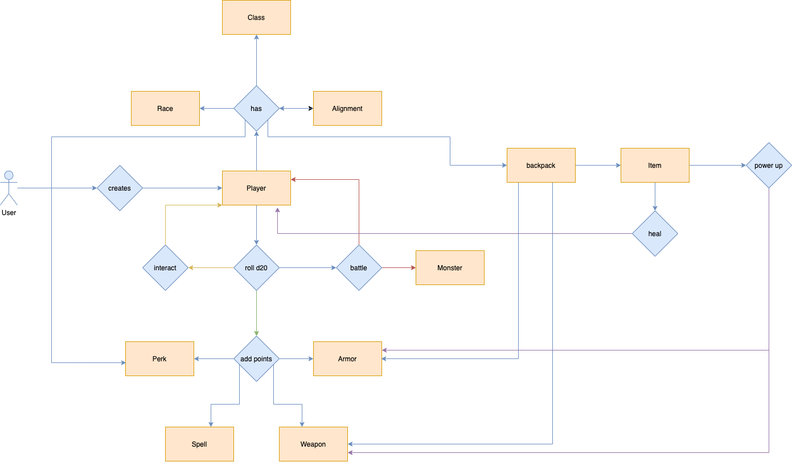

# dtwo-rpgaction

## Description
This repoisitory is part of a structure meant to serve as a general flow for future projects.
_______________________________
### Building and running
- To install dependencies for this project, use the `mvn install` command inside the root directory.
- To build this project with tests, use the `mvn clean test` command inside the root directory.
- To run SpringBoot project and utilize it's endpoints, use `mvn spring-boot:run` command inside the root directory.

| microservices flow                      |
|---------------------------------------- |
|  |
